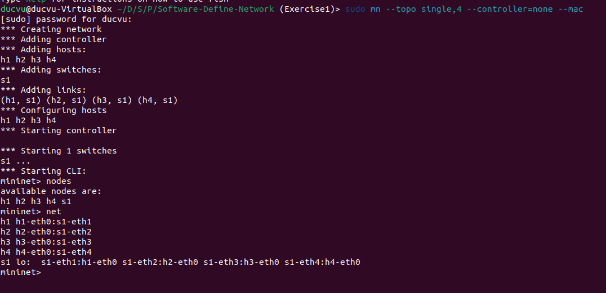
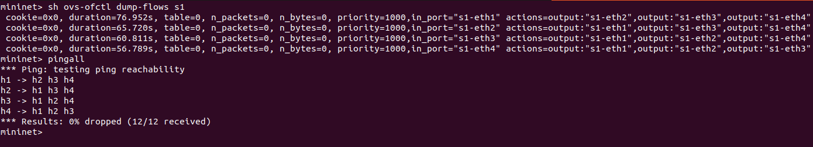

# Exercise 1
## Group members:
* Ho Duc Vu - 106200284 
* Nguyen Minh Phuong - 106200241
* Huynh Vu Dinh Phuong - 106200240

# Topic
* Start a topology with 1 switch and 4 hosts
* Manage the flow entries in the created network manually using 'ovs-ofctl' command
	* Check current status of the switch
	* Check flow entries in the switch and modify them (add/remove)
	* Implementing some basic forwarding entries with 'ovs-ofctl' command: Host 1 can send packet to any host, host 2 can sen packets to host 4, drop all packets from host 3
		* Use port number information
		* Use MAC address information
		* UsE IPpp address information
# Solution

## Start a topology with 1 switch and 4 hosts
### Code

```
sudo mn --topo single,4 --controller=none --mac
```
> --topo single,4: Use to create a switch and 4 host.\
> --controller=none: No controller.\
> --mac: Assign MAC address from 00:00:00:00:00:01 to 00:00:00:00:00:04 for host 1 to host 4.
### Result


## Manage the flow entries in the created network mmmanually using 'ovs-ofctl'

### Check curren status of the switch
#### Code
Show status current of switch 1
```
sh ovs-ofctl show s1
```
#### Result


### Check flow entries in the switch and modify them (add/remove)
#### Show table flows of switch 1
```
sh ovs-ofctl dump-flows s1
```
=> Result: Table is empty
#### Modify table flows
##### Code
```
sh ovs-ofctl add-flow s1 priority=1000,in_port=1,actions=output:2,3,4
sh ovs-ofctl add-flow s1 priority=1000,in_port=2,actions=output:1,3,4
sh ovs-ofctl add-flow s1 priority=1000,in_port=3,actions=output:1,2,4
sh ovs-ofctl add-flow s1 priority=1000,in_port=4,actions=output:1,2,3
// Show table flows and ping to check connect between hosts
sh ovs-ofctl dump-flows s1
pingall
```
##### Result


### Implementing some basic forwarding entries
* Host 1 can send packet to any host.
* Host 2 can send packets to host 4.
* Drop all packets from host 3.

#### Use port number information
```
sh ovs-ofctl dump-flows s1
```
