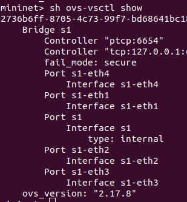
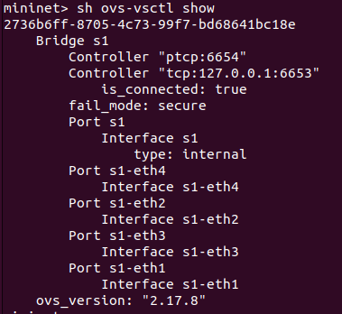
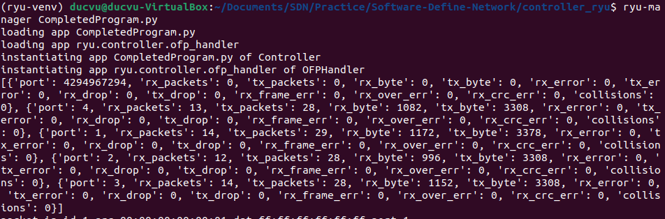
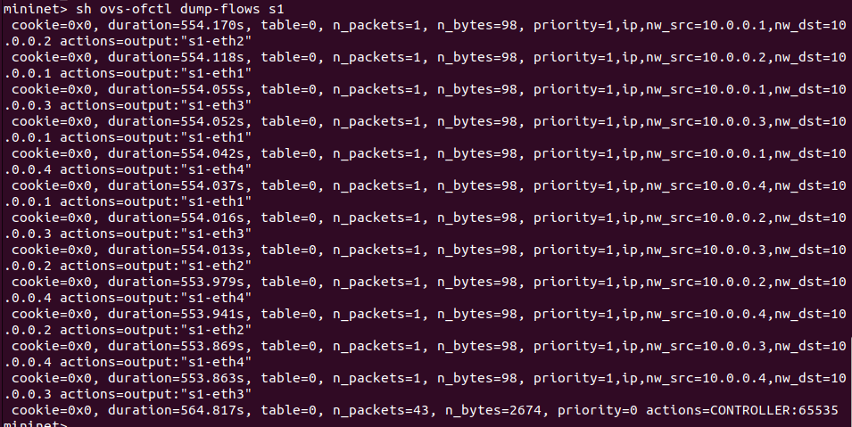
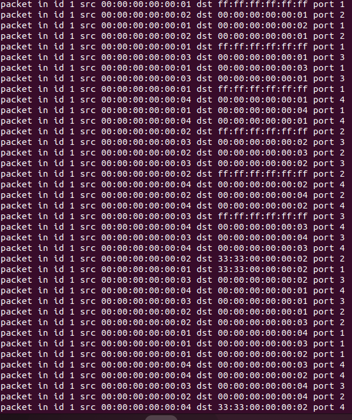

# Controller SDN with Ryu
## Group members:
* Ho Duc Vu - 106200284 
* Nguyen Minh Phuong - 106200241
* Huynh Vu Dinh Phuong - 106200240

# Topic
* Run Ryu controller on host 4 of the creater network in Exercise1
	* Capture all the message exchanged between the Ryu controller and the switch.
	* Send an 'OFPPortStatsRequest' to get current network statistics.
* [Topic detail](https://github.com/HODUCVU/Software-Define-Network/blob/Exercise-controller-ryu/Introduction%20to%20Mininet%20and%20OpenFlow.pdf)

# Fix ryu-manager error
* [Fix here](https://blog.csdn.net/weixin_41656968/article/details/130457754)
# Documents
* [Tutorial](https://ryu.readthedocs.io/en/latest/)
* [Learn Controller SDN](https://github.com/knetsolutions/learn-sdn-with-ryu)
* [Ryu with multipath controller](https://github.com/wildan2711/multipath)
## Run ryu
* Run ryu-manager fisrt
* Then check if the network switch is connected to controller?
```
source ryu-venv/bin/activate
ryu-manager <controller>.py
```
> source create virtual environment for ryu\
> run controller application by ryu-manager
* On mininet
```
sudo mn --topo single,4 --mac --controller remote --switch ovsk

sh ovs-vsctl show
```
> sh ovs-vsctk show: check connect to controller\


# Solution
## Create controller with ryu
* [Code here](controller_ryu/CompletedProgram.py)

## Implement
* Create Network
```
sudo mn --topo single,4 --mac --controller remote --switch ovsk

```
* Run Contrller
```
// Creat virtual environmennt for Ryu
source ryu-venv/bin/activate
// Run
ryu-manager /contoller_ryu/CompletedProgram.py

// Check controller connect to network
sh ovs-vsctl show
```
* Result: 
	* Status connect between controller and switch
		* is_connected = True.
		* switch connect to controller with IP 127.0.0.1, port 6653
		
	* show statistics of current network
		
	* When pingall in network 
		* Check entry table
		
		* Capture message between switch and controller
		

