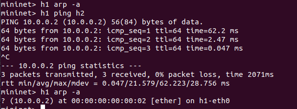
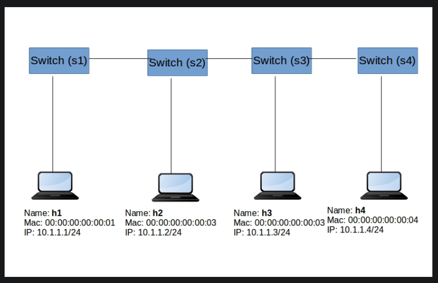
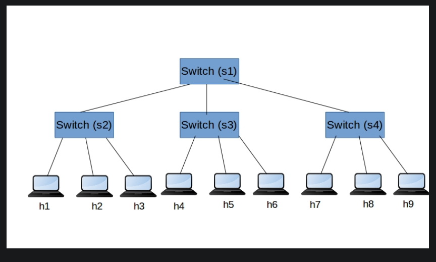

# SDN Contoller Lecture
* [Link](https://learning.knetsolutions.in/docs/ryu/)
# Lecture
## Get MAC Address in subnet by ping IP Address:
* To h1 get MAC Address of h2
	```
	mininet>h1 ping h2
	// see ARP (Address Resolution Protocol) of h1
	mininet>h1 arp -a
	```

	
* Delete MAC Address of host 2 in ARP entry of host 1
	```
	h1 arp -d 10.0.0.2
	```
## Create network with many topos
* Linear Topology
	```
	sudo mn --topo linear,4 --mac --controller remote,ip=127.0.0.1 -i 10.0.0.0/24 --switch ovsk
	```
	
* Tree Topology
	```
	sudo mn --topo tree,depth=2,fanout=3 --mac --controller remote,ip=127.0.0.1 -i 10.0.0.0/24 --switch ovsk
	```
	
* Single Topology
	```
	sudo mn --topo single,4 --mac --controller remote,ip=127.0.0.1 -i 10.0.0.0/24 --switch ovsk
	```
## Testing TCP and UDP bandwidth performance
* Simple test
	```
	mininet>iperf src-node dst-node
	```
	Example:
	> mininet> iperf h1 h2\
	Result: ['30.3 Gbits/sec', '30.2 Gbits/sec']
* Test detail: test connect between h1 and h4
	```
	mininet>xterm h1
	mininet>xterm h4
	```
	* In h1
		```
		iperf -u -s
		```
		> -u: UDP\
		> -s: server
	* In h4
		```
		iperf -u -c 10.0.0.1 -b 10m -i 10 -t 30
		iperf -u -c 10.0.0.1 -b 10m -i 10 -P 10 -t 30
		```
		> -c: client\
		> -i: reporting interval\
		> -t: test duration in seconds (test in 30s)\
		> -b 10m: bandwith 10Mbps\
		> -P: parallel connections (the number connect from h4 to h1)
## Run ryu
* Run virtual environment ryu
	```
	source ryu-venv/bin/activate
	```
* Run a simple ryu app to get infor packet
	```
	// Get infor from header packet when entries table don't have matching flows
	ryu-manager ryu.app.simple_switch_13
	```
* Check connect between controller and network:
	```
	mininet> sh ovs-vsctl show
	```
	> check connect stage\
	> check connect ip of controller
## OpenFlow

* Diagram openflow matching
	
	When packet is come, start at table 0 -> check matching in table 0 -> n.
	If header packet matching in a table k then goto table k an execute action set.
	Else check table miss, if it exists in this table, then execute action set, else drop packet.
* Action set
	> output port no\
	> group id\
	> drop\
	> set-queue queue id\
	> push-tag/pop-tag ethrtype (VLAN,MPLS,PBP)\
	> set-field type value\
	> change TTL (IP TTL< MPLS TTL)
	
### Openflow Messages
* Controller to Switch
	* Feature Request
	* Packet Out
	* Modify Flow Table
	* Modify Group Table
	* Modify Meter Table
	* OpenFlow Switch Description Request
	* OpenFlow Port Description Request
	* Openflow Statistics Request(Flow, Port, Flowtable, Aggregate, Group, Meter, Queue )
	* Role Request
	* Barrier Request
* Message transcation during the Topology setup	
	```
	// Messages sequence

	1. Hello
	2. Feature request/Response
	3. Switch/Port Description Request/Response
	4. Modify Flow Entry (To install table Miss entry)
	5. Packet IN (Switch to Controller)
	6. Packet Out (Controller to Switch)
	7. Modify Flow Entry (Install a flow)
	8. Echo
	```
	* Explain
		* **Hello message** are exchange between switch and controller upon connection startup, if version Openflow of switch different the controller then hello message will fail.
		* **Echo message** maily used to verify the connection between controller and switch. It also can be used to measure its latency or bandwidth.
		* **Features message** use to get basic info: *datapath ID, buffer, number of table, statistics* of switch.
		* **Modify Flow Entry** => use OFPT_FLOW_MOD to execute.
			```
			Command: ADD, MODIFY, MODIFY_STRICT, DELETE, DELETE_STRICT
			```
* Important note
	* Openflow version should match between the switch and Controller.
	* Controller App should process *Packet_in* message to build the Switching/Routing logic
	* Controller App sould process *Flow Modification* message to add/del/modify the flow in the switch.
	* Controller App should use *Flow Stats*. *Port Stats* request message to get the statistics of flows and ports.

## Ryu Implement
